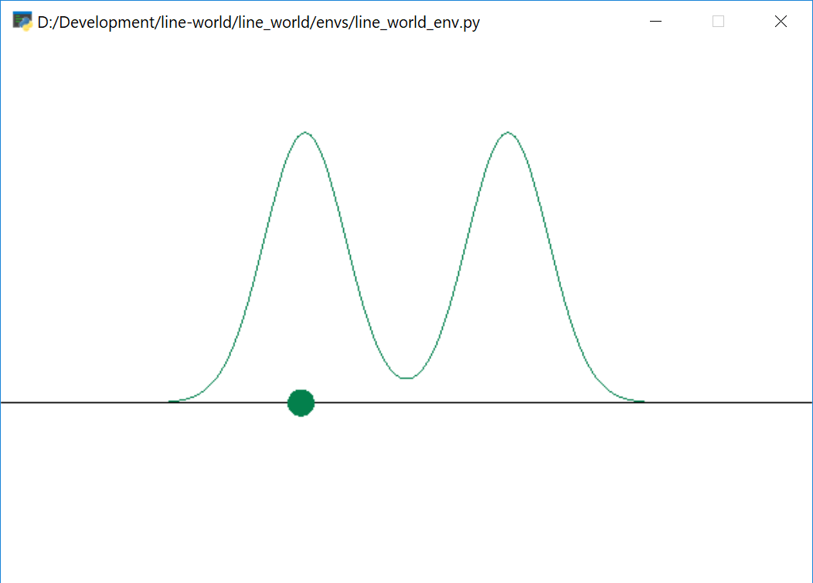
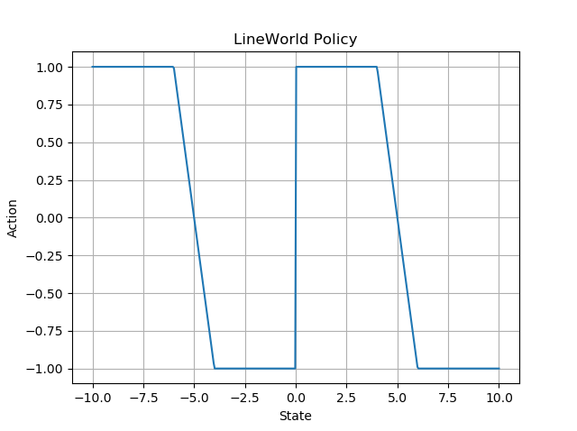

# line-world

A simple multi-modal continuous control RL environment.



The green dot is the agent's location and the two peaks show the multi-modal
reward structure.
The agent's action space is the range [-1, 1], which moves the agent
stochastically along the horizontal line.

## Installation

This package is not distributed on PyPI - you'll have to install from source.

```bash
git clone https://github.com/aaronsnoswell/line-world.git
cd line-world
pip install -e .
```

To test the installation

```python
from line_world.envs import demo
demo()
```

## Usage

Importing the package registers it with the gym environment register.

```python
import gym
import line_world
env = gym.make("LineWorld-v0")

# ... you can now use it like any other environment
env.render()
```

To train a `stable_baselines` agent,

```python
import gym
import line_world
from stable_baselines import PPO2

agent = PPO2('MlpPolicy', 'LineWorld-v0').learn(10000)
env = gym.make("LineWorld-v0")
observation = env.reset()
action, states = agent.predict(observation)
```

# Optimal policies

For symmetric versions of this task, the optimal policy can be queried from
`env._opt_pol()`.
The optimal policy for symmetric tasks is as follows;


